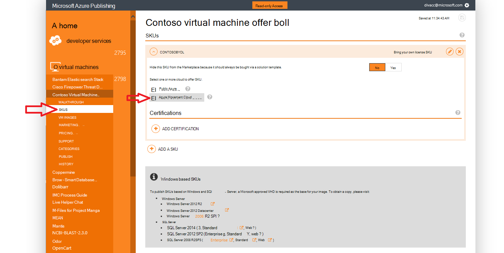
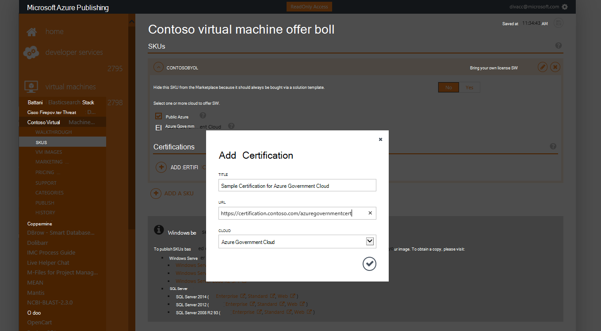
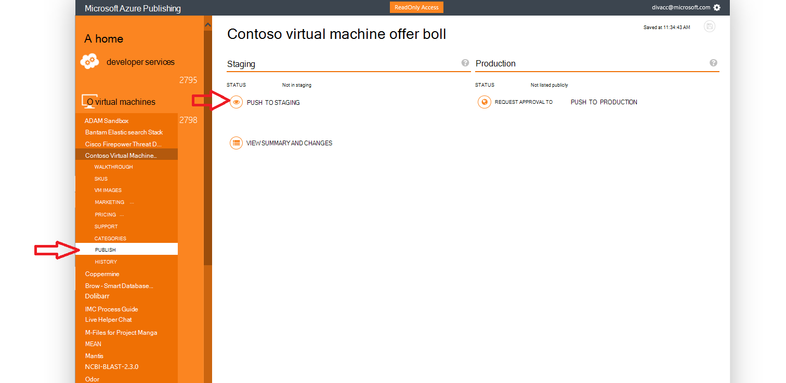
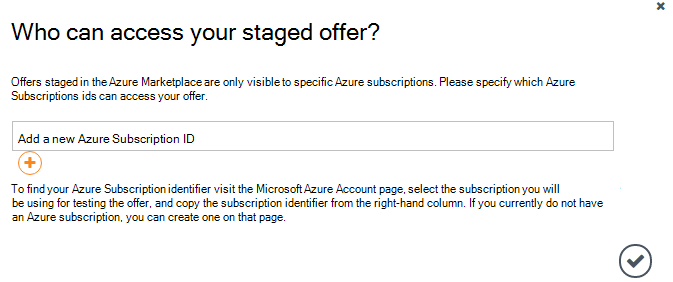
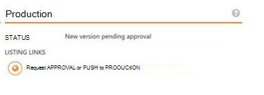

<properties
            pageTitle="Azure Government documentation | Microsoft Azure"
            description="This provides a comparison of features and guidance on developing applications for Azure Government."
            services="Azure-Government"
            cloud="gov"
            documentationCenter=""
            authors="tsingh"
            manager="asimm"
            editor=""/>
 
<tags    ms.service="multiple"
            ms.devlang="na"
            ms.topic="article"
            ms.tgt_pltfrm="na"
            ms.workload="azure-government"
            ms.date="10/20/2016"
            ms.author="zakramer;tsingh;divacc"/> 

# Azure Government Marketplace
For partners interested in publishing your offerings to the Azure Marketplace for Government, find the details below.

## Publishing
>[AZURE.NOTE] If you are not an existing Azure Certified Marketplace partner, complete the steps [here](../marketplace-publishing/marketplace-publishing-getting-started.md) before proceeding.

### Step 1  
Log on to [https://publish.windowsazure.com](https://publish.windowsazure.com)

### Step 2
Click the offer you want to publish

### Step 3
Click **SKUS** and click the Azure Government Cloud box

>[AZURE.NOTE] Only Bring Your Own License (BYOL) SKUs are supported.  This option is not available for Pay-as-You-Go (PayG) SKUs.

### Step 4
Click the + Add Certification link to add links to any certifications for your offer.

### Step 5
Request for a trial account in Microsoft Azure Government cloud to enable you to test your image in the publishing portal: [https://azuregov.microsoft.com/trial/azuregovtrial](https://azuregov.microsoft.com/trial/azuregovtrial)

Your eligibility as a partner who serves U.S. federal, state, local, or tribal entities are verified and confirmation will be provided via email.  Your trial account will be available within is 3-5 business days.

### Step 6
Click Publish and click Push to Staging. 

You will be prompted to enter a whitelisted subscription that has access to the staged offer. Enter the subscription ID from your newly acquired Azure Government trial account.

### Step 7
Once the offer is successfully staged, you can test your image by logging in to [https://portal.azure.us](https://portal.azure.us) using your Azure Government Trial account.

### Step 8
Once you have validated your image using the trial subscription, you can make the Offer available live by clicking on Publish and requesting approval to go to production. 

## Next steps

For supplemental information and updates, subscribe to the [Microsoft Azure Government Blog](https://blogs.msdn.microsoft.com/azuregov/).
