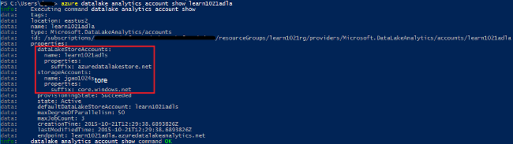
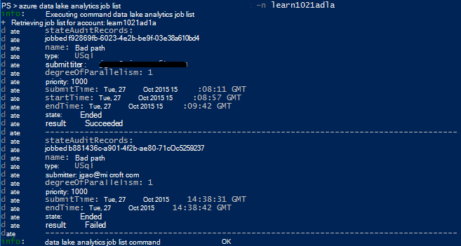
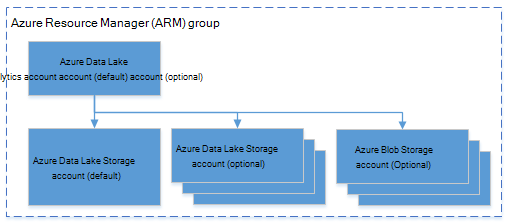

<properties 
   pageTitle="Manage Azure Data Lake Analytics using Azure Command-line Interface | Azure" 
   description="Learn how to manage Data Lake Analytics accounts, data sources, jobs and users using Azure CLI" 
   services="data-lake-analytics" 
   documentationCenter="" 
   authors="edmacauley" 
   manager="jhubbard" 
   editor="cgronlun"/>
 
<tags
   ms.service="data-lake-analytics"
   ms.devlang="na"
   ms.topic="article"
   ms.tgt_pltfrm="na"
   ms.workload="big-data" 
   ms.date="05/16/2016"
   ms.author="edmaca"/>

# Manage Azure Data Lake Analytics using Azure Command-line Interface (CLI)

[AZURE.INCLUDE [manage-selector](../../includes/data-lake-analytics-selector-manage.md)]

Learn how to manage Azure Data Lake Analytics accounts, data sources, users, and jobs using the Azure. To see management topic using other tools, click the tab select above.

**Prerequisites**

Before you begin this tutorial, you must have the following:

- **An Azure subscription**. See [Get Azure free trial](https://azure.microsoft.com/pricing/free-trial/).
- **Azure CLI**. See [Install and configure Azure CLI](../xplat-cli-install.md).
    - Download and install the **pre-release** [Azure CLI tools](https://github.com/MicrosoftBigData/AzureDataLake/releases) in order to complete this demo.
- **Authentication**, using the following command:

        azure login
    For more information on authenticating using a work or school account, see [Connect to an Azure subscription from the Azure CLI](../xplat-cli-connect.md).
- **Switch to the Azure Resource Manager mode**, using the following command:

        azure config mode arm

**To list the Data Lake Store and Data Lake Analytics commands:**

    azure datalake store
    azure datalake analytics

<!-- ################################ -->
<!-- ################################ -->
## Manage accounts

Before running any Data Lake Analytics jobs, you must have a Data Lake Analytics account. Unlike Azure HDInsight, you don't pay for an Analytics account when it is not running a job.  You only pay for the time when it is running a job.  For more information, see [Azure Data Lake Analytics Overview](data-lake-analytics-overview.md).  

###Create accounts

    azure datalake analytics account create "<Data Lake Analytics Account Name>" "<Azure Location>" "<Resource Group Name>" "<Default Data Lake Account Name>"

###Update accounts

The following command updates the properties of an existing Data Lake Analytics Account
    
    azure datalake analytics account set "<Data Lake Analytics Account Name>"

###List accounts

List Data Lake Analytics accounts 

    azure datalake analytics account list

List Data Lake Analytics accounts within a specific resource group

    azure datalake analytics account list -g "<Azure Resource Group Name>"

Get details of a specific Data Lake Analytics account

    azure datalake analytics account show -g "<Azure Resource Group Name>" -n "<Data Lake Analytics Account Name>"

###Delete Data Lake Analytics accounts

    azure datalake analytics account delete "<Data Lake Analytics Account Name>"

<!-- ################################ -->
<!-- ################################ -->
## Manage account data sources

Data Lake Analytics currently supports the following data sources:

- [Azure Data Lake Store](../data-lake-store/data-lake-store-overview.md)
- [Azure Storage](../storage/storage-introduction.md)

When you create an Analytics account, you must designate an Azure Data Lake Storage account to be the default storage account. The default ADL storage account is used to store job metadata and job audit logs. After you have created an Analytics account, you can add additional Data Lake Storage accounts and/or Azure Storage account. 

### Find the default ADL storage account

    azure datalake analytics account show "<Data Lake Analytics Account Name>"

The value is listed under properties:datalakeStoreAccount:name.

### Add additional Azure Blob storage accounts

    azure datalake analytics account datasource add -n "<Data Lake Analytics Account Name>" -b "<Azure Blob Storage Account Short Name>" -k "<Azure Storage Account Key>"

>[AZURE.NOTE] Only Blob storage short names are supported.  Don't use FQDN, for example "myblob.blob.core.windows.net".

### Add additional Data Lake Store accounts

    azure datalake analytics account datasource add -n "<Data Lake Analytics Account Name>" -l "<Data Lake Store Account Name>" [-d]

[-d] is an optional switch to indicate whether the Data Lake being added is the default Data Lake account. 

### Update existing data source

To set an existing Data Lake Store account to be the default:

    azure datalake analytics account datasource set -n "<Data Lake Analytics Account Name>" -l "<Azure Data Lake Store Account Name>" -d
      
To update an existing Blob storage account key:

    azure datalake analytics account datasource set -n "<Data Lake Analytics Account Name>" -b "<Blob Storage Account Name>" -k "<New Blob Storage Account Key>"

### List data sources:

    azure datalake analytics account show "<Data Lake Analytics Account Name>"
    

### Delete data sources:

To delete a Data Lake Store account:

    azure datalake analytics account datasource delete "<Data Lake Analytics Account Name>" "<Azure Data Lake Store Account Name>"

To delete a Blob storage account:

    azure datalake analytics account datasource delete "<Data Lake Analytics Account Name>" "<Blob Storage Account Name>"

## Manage jobs

You must have a Data Lake Analytics account before you can create a job.  For more information, see [Manage Data Lake Analytics accounts](#manage-accounts).

### List jobs

    azure datalake analytics job list -n "<Data Lake Analytics Account Name>"

### Get job details

    azure datalake analytics job show -n "<Data Lake Analytics Account Name>" -j "<Job ID>"
    
### Submit jobs

> [AZURE.NOTE] The default priority of a job is 1000, and the default degree of parallelism for a job is 1.

    azure datalake analytics job create  "<Data Lake Analytics Account Name>" "<Job Name>" "<Script>"

### Cancel jobs

Use the list command to find the job id, and then use cancel to cancel the job.

    azure datalake analytics job list -n "<Data Lake Analytics Account Name>"
    azure datalake analytics job cancel "<Data Lake Analytics Account Name>" "<Job ID>"

## Manage catalog

The U-SQL catalog is used to structure data and code so they can be shared by U-SQL scripts. The catalog enables the highest performance possible with data in Azure Data Lake. For more information, see [Use U-SQL catalog](data-lake-analytics-use-u-sql-catalog.md).
 
###List catalog items

    #List databases
    azure datalake analytics catalog list -n "<Data Lake Analytics Account Name>" -t database

    #List tables
    azure datalake analytics catalog list -n "<Data Lake Analytics Account Name>" -t table
    
The types include database, schema, assembly, external data source, table, table valued function or table statistics.

###Create catalog secret

    azure datalake analytics catalog secret create -n "<Data Lake Analytics Account Name>" <databaseName> <hostUri> <secretName>

### Modify catalog secret

    azure datalake analytics catalog secret set -n "<Data Lake Analytics Account Name>" <databaseName> <hostUri> <secretName>

###Delete catalog secret

    azure datalake analytics catalog secrete delete -n "<Data Lake Analytics Account Name>" <databaseName> <hostUri> <secretName>

<!-- ################################ -->
<!-- ################################ -->
## Use ARM groups

Applications are typically made up of many components, for example a web app, database, database server, storage, and 3rd party services. Azure Resource Manager (ARM) enables you to work with the resources in your application as a group, referred to as an Azure Resource Group. You can deploy, update, monitor or delete all of the resources for your application in a single, coordinated operation. You use a template for deployment and that template can work for different environments such as testing, staging and production. You can clarify billing for your organization by viewing the rolled-up costs for the entire group. For more information, see [Azure Resource Manager Overview](../azure-resource-manager/resource-group-overview.md). 

A Data Lake Analytics service can include the following components:

- Azure Data Lake Analytics account
- Required default Azure Data Lake Storage account
- Additional Azure Data Lake Storage accounts
- Additional Azure Storage accounts

You can create all these components under one ARM group to make them easier to manage.

A Data Lake Analytics account and the dependent storage accounts must be placed in the same Azure data center.
The ARM group however can be located in a different data center.  

##See also 

- [Overview of Microsoft Azure Data Lake Analytics](data-lake-analytics-overview.md)
- [Get started with Data Lake Analytics using Azure Portal](data-lake-analytics-get-started-portal.md)
- [Manage Azure Data Lake Analytics using Azure Portal](data-lake-analytics-manage-use-portal.md)
- [Monitor and troubleshoot Azure Data Lake Analytics jobs using Azure Portal](data-lake-analytics-monitor-and-troubleshoot-jobs-tutorial.md)

